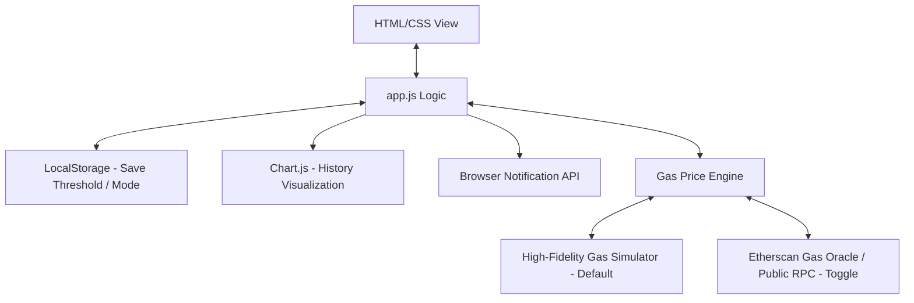

# Implementation Plan: Web3 Gas Price Tracker Dashboard

A elegant, high-fidelity, beginner-friendly Web3 Gas Price Tracker Dashboard designed to run 100% in the frontend. It features real-time gas tracking (Slow, Standard, Fast), an interactive historical chart, a custom gas threshold alert system with local persistence, in-browser notifications, and a hybrid simulation/live API mode that works out-of-the-box.

---

## 1. Project Architecture

The architecture is kept **simple, clean, and frontend-only**. This maximizes development speed, makes deployment trivial, and ensures that the learner can see exactly how all parts of a Web3 frontend connect without managing a Node.js server.



### Key Architectural Pillars:
1. **The Presentation Layer (`index.html` + `styles.css`)**: Uses semantic HTML5, modern CSS Grid/Flexbox, Custom Properties (variables), and a modern glassmorphism design language.
2. **The Logic Controller (`app.js`)**: Coordinates API fetching, Chart.js updates, browser notifications, and user configuration persistence.
3. **The Storage Layer (`localStorage`)**: Persists user preferences like the custom gas threshold and theme choices across page reloads.
4. **The Gas Price Engine**: A wrapper that retrieves data. It offers a **Simulation Mode** (guarantees a 100% operational demo with realistic live fluctuations) and a **Live Mode** (connects to Etherscan or public RPC nodes).

---

## 2. Gas API & Polling Mechanics

### How the Gas API Works (EIP-1559 Context)
Modern Ethereum transaction fees are calculated using **EIP-1559** guidelines:
$$\text{Total Gas Price} = \text{Base Fee (burned)} + \text{Priority Fee (tip to validator)}$$
*   **Base Fee**: Determined algorithmically by network congestion on the previous block.
*   **Priority Fee**: A tip set by the user to speed up transaction inclusion.

The **Etherscan Gas Oracle API** calculates these values by scanning recent blocks and outputs:
*   `SafeGasPrice` (Slow - typical base fee + low tip)
*   `ProposeGasPrice` (Standard - base fee + medium tip)
*   `FastGasPrice` (Fast - base fee + high tip)

### Polling & Refreshing Mechanics
To achieve real-time tracking, we implement an auto-polling system in JavaScript using `setInterval`:
*   **Interval**: **12 seconds** (matches Ethereum's average block time, ensuring we fetch fresh data only when new blocks are mined).
*   **Request Optimization**: A visual progress bar or countdown timer lets the user know when the next refresh is scheduled, preventing unnecessary API spam.
*   **Rate-Limit Guard**: We include automatic exponential backoff or user-friendly error banners if API rate limits (e.g., 5 requests/sec on Etherscan free tier) are hit.

---

## 3. Browser Notifications Mechanics

The Web Notification API allows the browser to display system-level alerts even if the user is looking at another tab.

### Lifecyle & Methods:
1. **Permission Check**: Before sending notifications, we must check if permission is already granted (`Notification.permission`).
2. **Request Permission**: If not granted, the user must explicitly click a UI button to approve permission using:
   ```javascript
   Notification.requestPermission().then(permission => { ... });
   ```
3. **Trigger Notification**: Once granted, a system-level popup can be generated dynamically:
   ```javascript
   new Notification("Gas Alert!", {
       body: `Ethereum gas has dropped to ${currentGas} Gwei, below your threshold of ${threshold} Gwei!`,
       icon: "./assets/gas-icon.png" // or a favicon
   });
   ```

---

## 4. Suggested Features for a 1–2 Hour Scope

To stay strictly within the 1-2 hour scope while ensuring high educational value and "wow" factor:

| Feature | Description | Complexity | Priority |
| :--- | :--- | :--- | :--- |
| **Real-time Gas Cards** | Beautiful cards showing Slow, Standard, Fast prices with icons & estimated tx speeds. | Low | Critical |
| **24h Historical Chart** | A gorgeous gradient chart using **Chart.js** displaying gas price history. | Medium | Critical |
| **Threshold Alert Slider** | Input to set alert threshold. Visually lights up when gas is below threshold. | Low | Critical |
| **Browser Push Alerts** | Real-time system notifications triggered when threshold criteria are met. | Medium | Critical |
| **Hybrid Mock/Live Toggle**| Toggle between simulation and Etherscan API (supports custom API keys). | Medium | High |
| **Dark/Light Mode** | Modern slate-dark theme default with a premium light theme transition. | Low | Nice-to-Have |
| **LocalStorage Persistence**| Keeps threshold value and theme selection saved between visits. | Low | Nice-to-Have |
| **Network Pulsing Indicator**| Visual "pulse" animation indicating when updates are being fetched. | Low | Nice-to-Have |

---

## 5. Folder Structure

```text
Web3-Gas-Price-Tracker/
├── index.html          # Shell, structural elements, CDN imports
├── styles.css          # Color variables, layout, animations, responsive design
├── app.js              # State, simulation logic, API client, charts, alerts
├── README.md           # Project guide and instructions
└── docs/               # Technical design and documentation folder
    ├── implementation_plan.md
    ├── task.md
    └── walkthrough.md
```

---

## 6. Proposed Implementation Steps

### Phase 1: Foundation & Styling (`styles.css` & `index.html`)
*   Define design tokens (colors, animations, fonts, shadows) using CSS variables.
*   Construct the semantic HTML structure: Header, Gas Cards grid, Control Panel, Chart Panel, and Footer.
*   Style the cards with a modern **glassmorphic** look (fine border, background blur, subtle gradients).

### Phase 2: Core JavaScript Logic (`app.js`)
*   Build the state manager holding `gasPriceHistory`, `currentPrices`, `threshold`, and `apiMode`.
*   Implement the **Gas Simulator Engine** which generates highly realistic, fluctuating values around real-world levels (e.g. 20-30 Gwei) for seamless out-of-the-box usage.
*   Implement Etherscan Gas Oracle fetching logic with error handling.
*   Setup `setInterval` polling (every 12 seconds) with a smooth UI countdown bar.

### Phase 3: Visualizations & Push Alerts
*   Configure **Chart.js** to draw a beautiful, responsive area chart with modern colored gradients.
*   Wire up the Gas Threshold configuration UI. Save values in `localStorage`.
*   Integrate the browser Notification API, including safe checks for mobile/desktop support and permission requests.
*   Trigger notifications when gas drops below the user-defined threshold (with a cooldown so we don't spam notifications).

### Phase 4: Polish & Refine
*   Add a light/dark mode switch.
*   Implement elegant micro-animations (e.g., pulse animations, hover lifts, spinning reload icon).
*   Add informative tooltips or info sections explaining EIP-1559 (Gwei, base fee, priority fee) for maximum learning utility.

---

## 7. Verification Plan

### Automated/Code Verification
*   Open the browser using the subagent tool to interact with the dashboard.
*   Verify responsive layout sizing at mobile and desktop breakpoints.
*   Test that the Gas Simulator triggers realistic values and successfully populates the historical chart.
*   Check JavaScript console logs for clean execution with no errors.

### Manual Verification Steps (For User)
*   **Threshold Triggering**: Set the threshold to a value slightly *above* the current standard gas price. Observe if the browser immediately prompts for notification permissions (if not already given) and fires a push alert when the next poll tick triggers.
*   **API Key Toggle**: Toggle on "Live Mode", input a custom Etherscan API key, and check if it pulls live data from the Ethereum network successfully.
*   **LocalStorage Persistence**: Refresh the browser page and ensure your threshold value and dark/light mode preference remain saved.

---

## 8. Deployment to Vercel

Since this is a 100% client-side application, deploying to Vercel is incredibly fast and free:
1. **GitHub integration**: Connect the GitHub repository directly to Vercel. Vercel automatically detects the HTML/CSS/JS files and deploys them without any build commands!
2. **Alternative (Vercel CLI)**: Run `vercel` in the terminal to deploy directly in 30 seconds.

---

## 9. Common Mistakes & Pitfalls

*   **API Rate Limits**: Etherscan's free tier allows 5 requests per second. If multiple tabs are open or page refreshes are too frequent, the API returns a status error. We prevent this by keeping polling at a relaxed 12s and recommending simulation mode for heavy local testing.
*   **Chart.js Reinitialization Error**: Re-drawing a chart on an active canvas element throws an error. We will write solid code that keeps a single chart instance and updates its data using `chart.update()`.
*   **Missing Notification Permission Context**: Attempting to ask for notification permissions on load can be blocked by browsers. Permissions *must* be requested inside a direct user interaction event (like clicking an "Enable Alerts" button).
